This is a personal repo containing my most useful dotfiles and brew packages. Most formulae and casks I use are based on [`rust`](https://www.rust-lang.org/), so they're ***:fire: `blazingly fast` :fire:***.


<br>
<br>


# CLI Tools
## [`homesick`](https://github.com/technicalpickles/homesick)

The dotfiles in this repo are tracked and synced with [`homesick`](https://github.com/technicalpickles/homesick). 
> Homesick is sorta like [rip](http://github.com/defunkt/rip), but for dotfiles. It uses git to clone a repository containing dotfiles, and saves them in `~/.homesick`. It then allows you to symlink all the dotfiles into place with a single command.

```zsh
# clones this repo to $HOME/.homesick/repos/dotfiles
homeshick clone https://github.com/mateipinzaru2/dotfiles.git
```

> [!CAUTION]
> This might blow up your Mac, dunno :shrug:.
```zsh
# replaces dotfiles with symlinks for all files in this repo under the current's user $HOME directory
homeshick link dotfiles
```


## [`lazygit`](https://github.com/jesseduffield/lazygit?tab=readme-ov-file)

>A simple terminal UI for git commands


## [`starship`](https://starship.rs/)
>The minimal, blazing-fast, and infinitely customizable prompt for any shell!

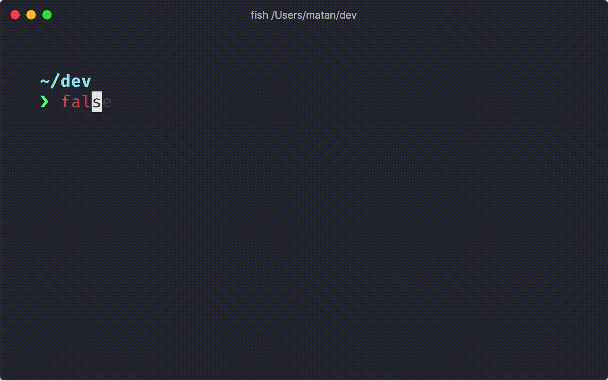


## [`eza`](https://github.com/eza-community/eza)
like `ls` but ***:fire: `blazingly fast` :fire:***.

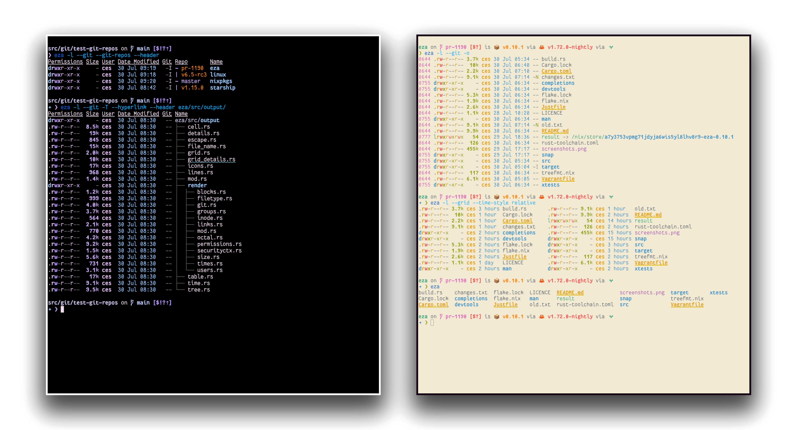


## [`bat`](https://github.com/sharkdp/bat)
> `bat`: A `cat` clone with wings.

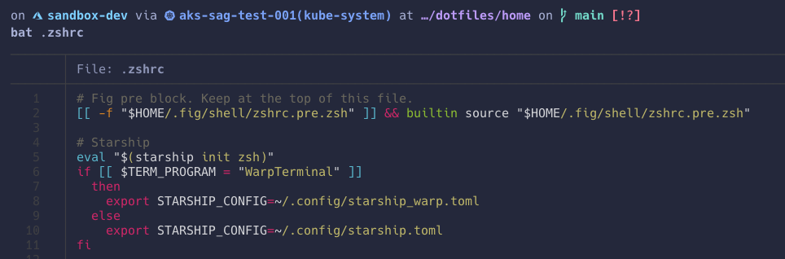


## [`bfg`](https://github.com/rtyley/bfg-repo-cleaner)
> Removes large or troublesome blobs like `git-filter-branch` does, but faster - and written in Scala.

:wink:


## [`broot`](https://github.com/Canop/broot)
Tired of `cd; ls; cd; ls; cd; ls;...` ?
> broot is a better way to navigate directories

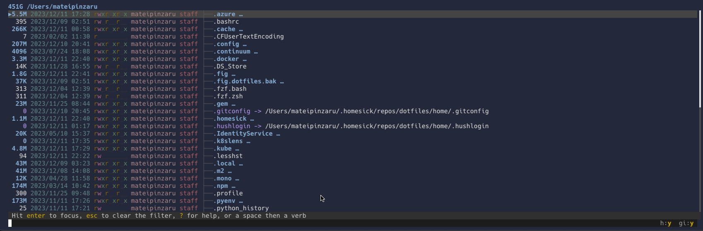


## [`diff-so-fancy`](https://github.com/so-fancy/diff-so-fancy)
> fancy cli diff

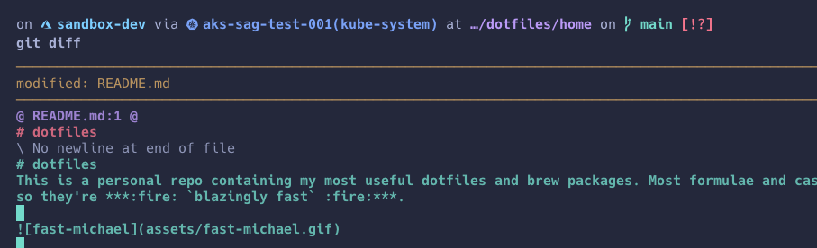


## [`fzf`](https://github.com/junegunn/fzf)
If you install only one of the cli-apps here, let it be this one. It's truly :exploding_head: not to mention ***:fire: `blazingly fast` :fire:***. There's literally nothing it can't do, or rather ***`find`***.

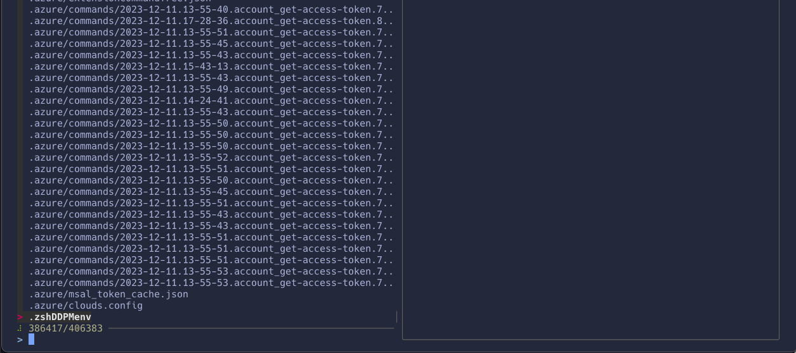


## [`ripgrep`](https://github.com/BurntSushi/ripgrep)
`grep` but on steroids, built on [`rust`](https://www.rust-lang.org/), which means it's ***:fire: `blazingly fast` :fire:***. It also goes :raised_hand:-in-:raised_hand: with `fzf` so of course you gotta get this one too.

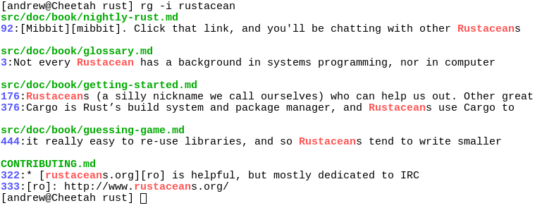


## [`tldr`](https://github.com/tldr-pages/tldr)
Why `--help` when you can `tldr {{cli_tool}}`

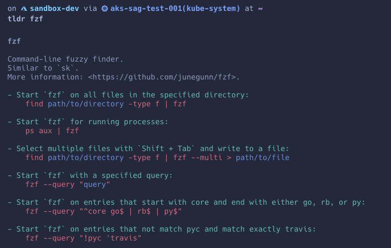


<br>
<br>


# Apps
## [`warp`](https://www.warp.dev/)
>Warp is a modern, Rust-based terminal that pins the prompt in place and supports IDE-style text editing.

[](https://www.youtube.com/embed/XWQY8LgkiXM)

The `warp` theme I use is called [`Tokyo Night Storm`](https://github.com/bart-krakowski/warp-tokyo-night).

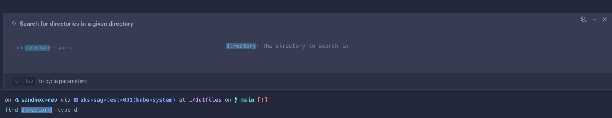


## [`raycast`](https://www.raycast.com/)
I know I'm repeating myself, but if you install only one of the brew casks here, let it be this one. It's truly :exploding_head: not to mention ***:fire: `blazingly fast` :fire:***. There's literally nothing it can't do, like, really.

It can do everything that `Spotlight` can and much MUCH more, not to mention it's infinitely extensible and customizable.

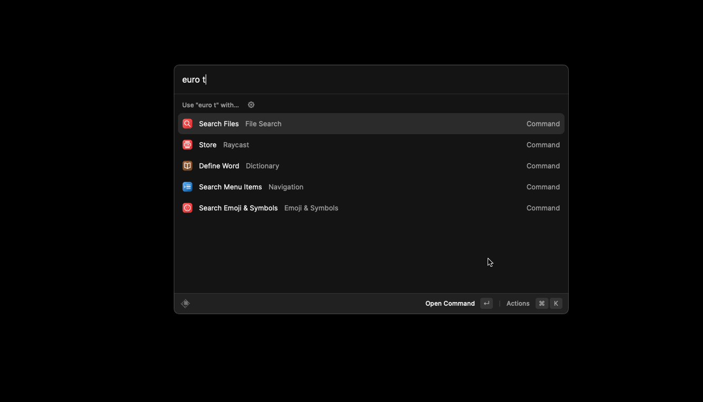


## [`arc`](https://arc.net/)
The "***more than a browser***" thing? Pretty legit. :fire::fire::fire:


## [`cheatsheet`](https://macmenubar.com/cheatsheet/)
`brew install --cask cheatsheet`
> and just hold down the `command` key.

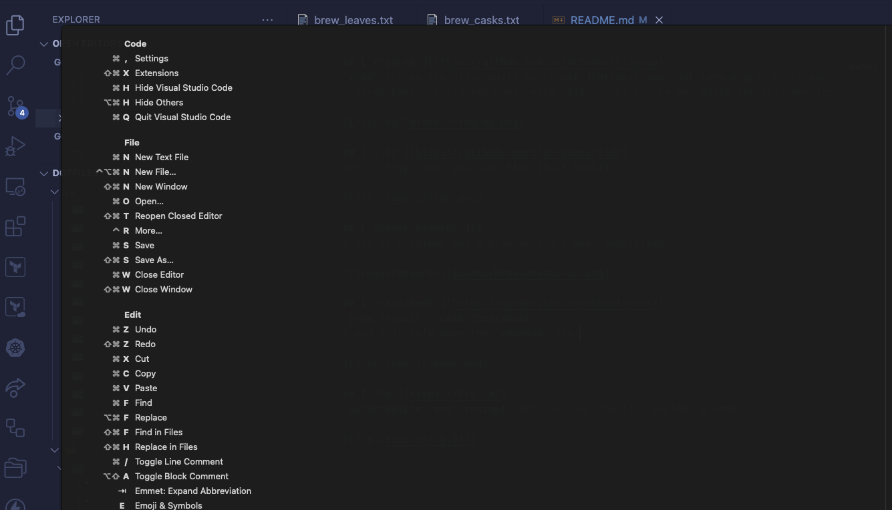


## [`hiddenbar`](https://github.com/dwarvesf/hidden)
The mess in your menu bar got you down? No worries! You can sweep it under the rug with `hiddenbar`!

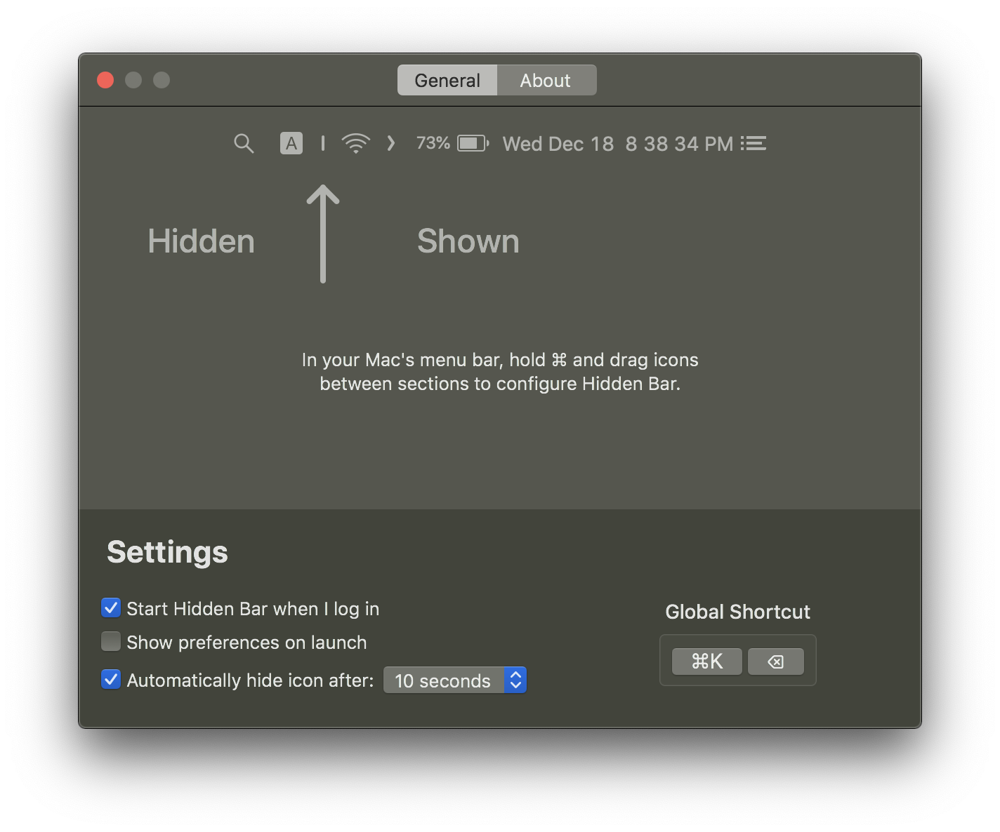


## [`keepingyouawake`](https://github.com/newmarcel/KeepingYouAwake)
`red-bull` for your Mac's screen.

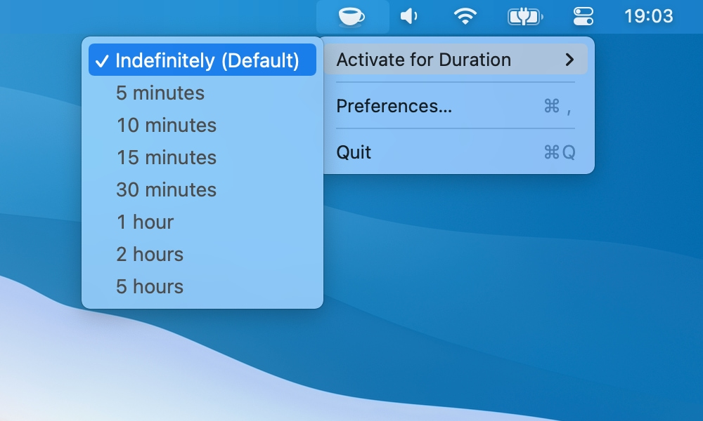